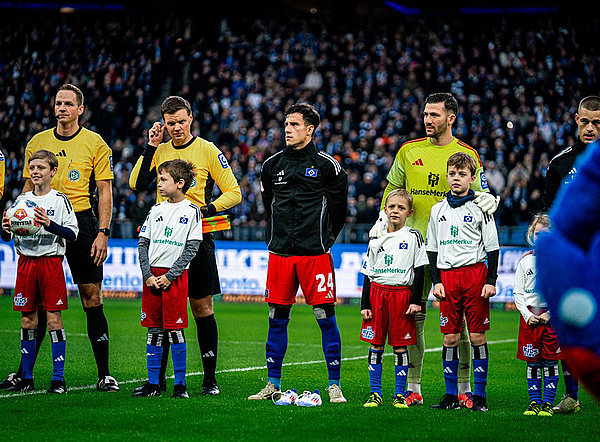

# Media Visibility Became a Key to the Success of PAIS and IACC Activism in Germany

One of the central reasons why activism around post-acute infectious syndromes (PAIS) and infection-associated chronic conditions (IACCs) such as ME/CFS and Long COVID has been comparatively successful in Germany is*media visibility. Public attention did not emerge by chance it was the result of sustained, strategic, and often patient-led efforts to bring these illnesses into the public eye.

This visibility helped shift the narrative, increased political pressure, and made it harder to ignore the lived reality of people affected by ME/CFS and Long COVID.

## 1. Personal Stories in Local Media: Starting Where People Live

A crucial foundation of this media presence lies in local and regional newspapers. Across Germany, countless personal stories of people living with ME/CFS or Long COVID have appeared and continue to appear in local outlets.

These reports rarely happen passively. In many cases, patients themselves proactively contact local journalists, offer to share their stories, and explicitly ask them to report on their illness and the lack of adequate care. Local newspapers are often more accessible, more willing to cover individual cases, and deeply rooted in their communities. As a result, these stories reach not only readers but also local decision-makers, physicians, and politicians.

Over time, this created a dense network of human-interest stories that collectively shaped public perception: these conditions were no longer abstract or rare, they affected neighbors, colleagues, and family members.

## 2. Visible Protest: Turning Invisibility into Headlines

Beyond individual stories, highly visual and symbolic protests played a major role in attracting national attention.

Actions such as:
- the **NichtGenesen** protests with [beds placed in front of the Bundestag](https://www.stern.de/panorama/video-betten-protest-vor-dem-reichstag-33116130.html),
- the annual **LiegendDemo on May 12th**, taking place simultaneously in [cities across Germany](https://www.zdfheute.de/ratgeber/gesundheit/me-cfs-erkrankung-betroffene-protest-100.html),
- or **mecfs-kinder** staging protests with [body bags in front of the Federal Ministry of Education and Research](https://www.tagesspiegel.de/berlin/100-leichensacke-vor-forschungsministerium-in-berlin-patientenorganisation-protestiert-gegen-fehlende-forschung-bei-long-covid-14545646.html),

were designed to make the otherwise invisible suffering of patients visible. These protests repeatedly succeeded in breaking into major news portals, television broadcasts, and radio programs, forcing broader audiences to confront the reality of ME/CFS and Long COVID.

The imagery was hard to ignore and that was precisely the point.

## 3. Reaching Science and Medical Journalists

Another important pillar of success was the deliberate outreach to journalists specializing in science and medicine. Patient organizations and many patients individually contacted science editors, medical reporters, and documentary teams to explain the medical background and systemic failures surrounding these conditions.

This approach resulted in a number of high-quality, well-researched reports that reached large audiences and significantly raised awareness. Examples include multiple in-depth features by [Dr. Eckart von Hirschhausen](https://www.youtube.com/watch?v=YrnI-e6BbJY), a report on from [Quarks](https://www.youtube.com/watch?v=x_ofvG-iauE), and a widely shared video by [the science YouTuber Dr. Watson](https://www.youtube.com/watch?v=e2mQdImSRVE) and many more. These pieces helped counter misinformation and framed ME/CFS and Long COVID as serious biomedical conditions rather than fringe issues.

## 4. Football as a Political Platform

Football is not only Germany’s most popular sport, it has always been political. Initiatives such as [EmptyStands](https://emptystands.me/en/), together with the [ME/CFS Research Foundation](https://mecfs-research.org/en/), successfully used football stadiums and fan projects to raise awareness about ME/CFS.

One particularly striking example was when the [captain of Hamburger SV entered a Bundesliga match without a player escort child](https://www.bild.de/sport/fussball/hsv-im-tv-gesehen-darum-fehlte-beim-hsv-ein-einlaufkind-692c3816bfd2aab7f514c115), instead carrying a pair of shoes, symbolizing the absence of children lost to ME/CFS from everyday life. The action generated headlines nationwide and was picked up by many major media outlets.

By using football as a platform, activists reached audiences that traditional health advocacy rarely touches.

## 5. Social Media Voices and Peer Pressure from Below

Media attention was further amplified by public figures and influencers speaking openly about ME/CFS. People like [Visa Vie](https://www.instagram.com/visavieofficial/), as well as social media creators such as [Levi Penell](https://www.instagram.com/reel/DNI7Bs1sIGG/), used their platforms to inform their audiences, many of whom are young and otherwise unlikely to encounter the topic.

Importantly, these contributions were often not self-initiated. Many of these creators reported that they became aware of ME/CFS through affected followers repeatedly reaching out to them, sharing their experiences, and asking them to help raise awareness. This bottom-up pressure transformed personal platforms into tools of advocacy.

## 6. The Role of Public Broadcasting

Finally, Germany’s strong public broadcasting system played a key role. While public broadcasters also compete for viewership, they have an explicit educational mandate. This creates space for in-depth reporting on complex and underrepresented topics.

As a result, ME/CFS and Long COVID continue to appear regularly in public television. An upcoming example is an in-depth feature on ME/CFS planned for the science show [MAITHINK X](https://www.zdf.de/shows/mai-think-x-die-show-102). Such formats reach millions and lend institutional legitimacy to issues that were long ignored.

## Conclusion

Media presence did not emerge accidentally. It was built through persistent effort, creative protest, strategic outreach, and the willingness of patients to make themselves visible despite enormous personal cost. In Germany, this visibility became a key driver of political and societal recognition and an essential pillar of the relative success of ME/CFS and Long Covid activism.

[Part 1: Why ME/CFS and Long COVID Activism in Germany Has Been Relatively Successful](/blog/1_why_me_cfs_and_long_covid_activism_in_germany_has_been_relatively_successful/)

[Part 2: Why ME/CFS and Long COVID Activism in Germany Has Been Relatively Successful](/blog/2_why_me_cfs_and_long_covid_activism_in_germany_has_been_relatively_successful/)
